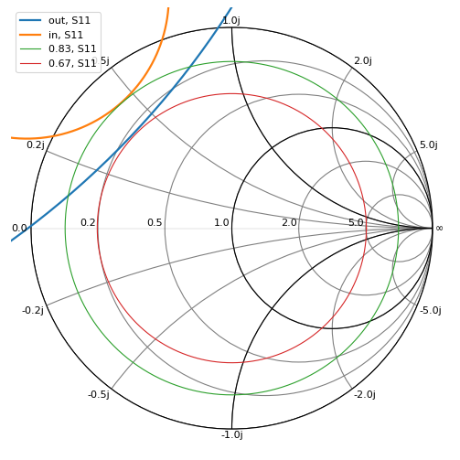
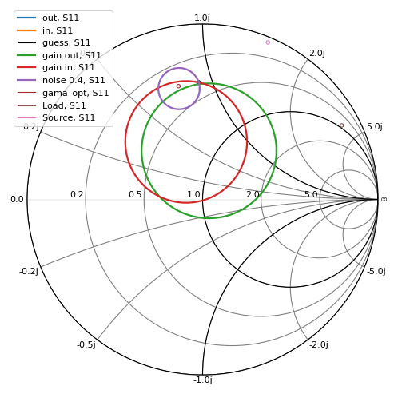
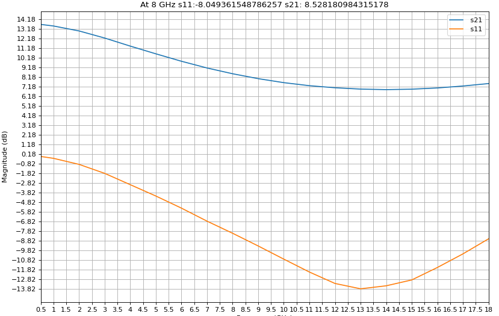
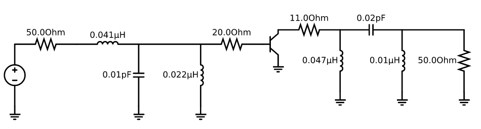
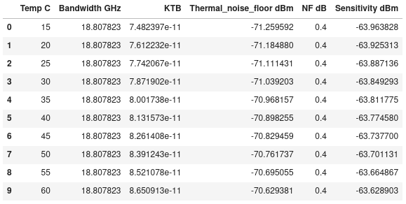

# LNA
Designing an ultra Low-noise amplifier by python.
## About
[ATF-36077](atf36077.pdf) Pseudomorphic HEMT transistor is used in this project to design the LNA at 8 Ghz using S parameters from Touchstone file.

[show code](code.ipynb)
## Screanshots






# Requirements
```
numpy
matplotlib
scipy
plotly
scikit-rf
schemdraw
```